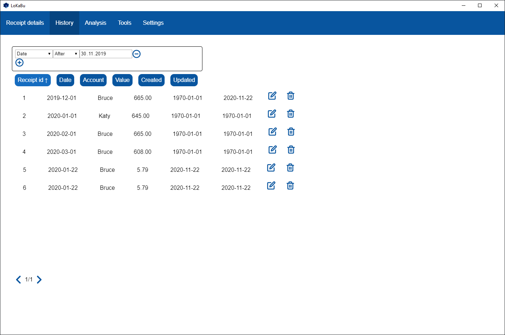
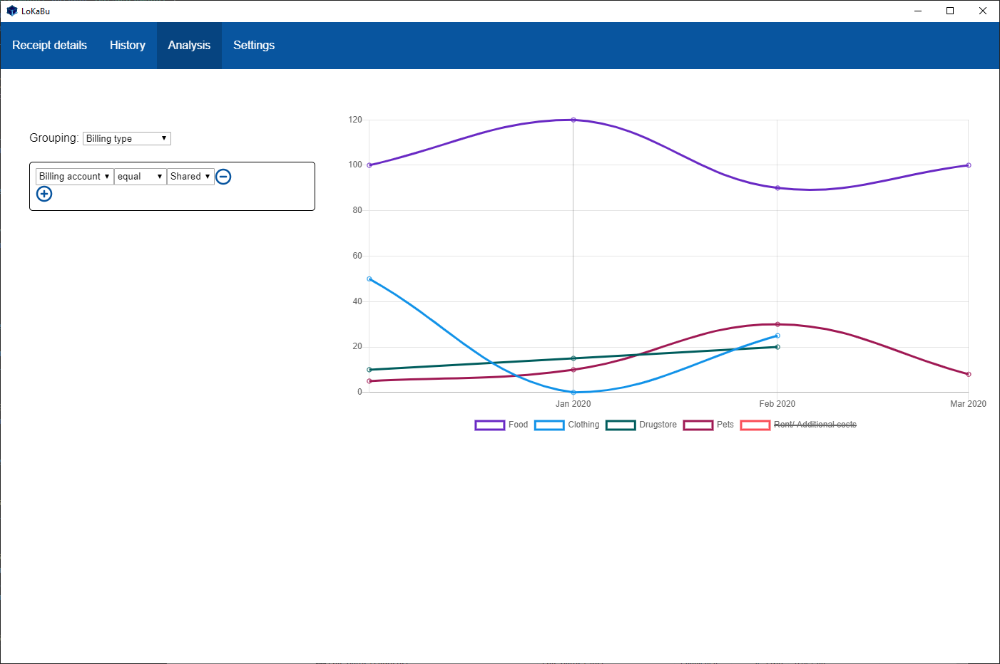
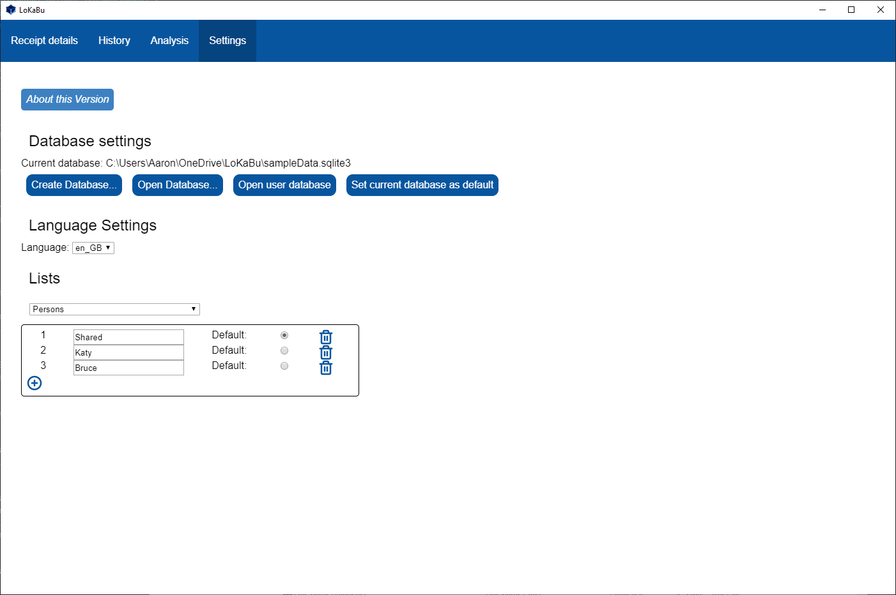

This document is available in: [Deutsch](./README_DE.md), [English](./README.md)
#  LoKaBu [![Latest Release][releaseBadge]][releaseLink] [![Release status][buildBadge]][buildLink] [![GitHub Actions status][testBadge]][testLink]

This project realizes a cash book for the normal household. The core idea of the project is to have full control over the data that is stored. This Project is based on the combination of the framework Electron and the file based database SQLite3
## Features
### Create/ Open Database
You can add in addition to the user default another database which can be loacted wherever you want. With this you can share the cash book in a network folder like OneDrive or Dropbox. There are checks implemented to allow only one user at a time to avoid constant changing data. You get notified if there is concurrent work going on.

### Adding Receipt
You can add, update and delete receipts. The categorization gets unified by predefined lists to achieve better analytic results. You are able to add comments to an receipt to find them later easier or to store other informations.

### History
Within the history you can filter the receipts via various filter fields and options.

### Configuration of static Lists and Values
After you have added another cash book you are able to mark this cash book as the default one. You can also save default values for all lists add and change the the entries.
  *	Persons
  *	Accounts (which are owned by a person)
  *	Stores
  *	Payment Groups

### Language support
There is the possibilty to add new languages. Currently the following languages ar available:
  * English
  * German

## Usage on other Platforms then Windows
You have to build (and sign) your platform-dependent build yourself or just use this repository locally.

## Known Issues
  * Problem: The initial installation requires a database upgrade which fails.
    * Restart the application
    * Delete all files in `%APPDATA%/LoKaBu`

## Contributions
  * The Logo was made by [Kirschdrache](https://www.deviantart.com/kirschdrache)
  * The busy indicator was made available by [loading.io/css/](loading.io/css/)

## Screenshots
  
  
  
  

[releaseBadge]: https://img.shields.io/github/v/release/H0rn0chse/LoKaBu.svg
[releaseLink]: https://github.com/H0rn0chse/LoKaBu/releases/latest
[buildBadge]: https://github.com/H0rn0chse/LoKaBu/workflows/Release/badge.svg?branch=feature%2FelectronTransformation
[buildLink]: https://github.com/H0rn0chse/LoKaBu/actions?query=workflow%3ARelease
[testBadge]: https://github.com/H0rn0chse/LoKaBu/workflows/Test/badge.svg?branch=feature%2FelectronTransformation
[testLink]: https://github.com/H0rn0chse/LoKaBu/actions?query=workflow%3ATest