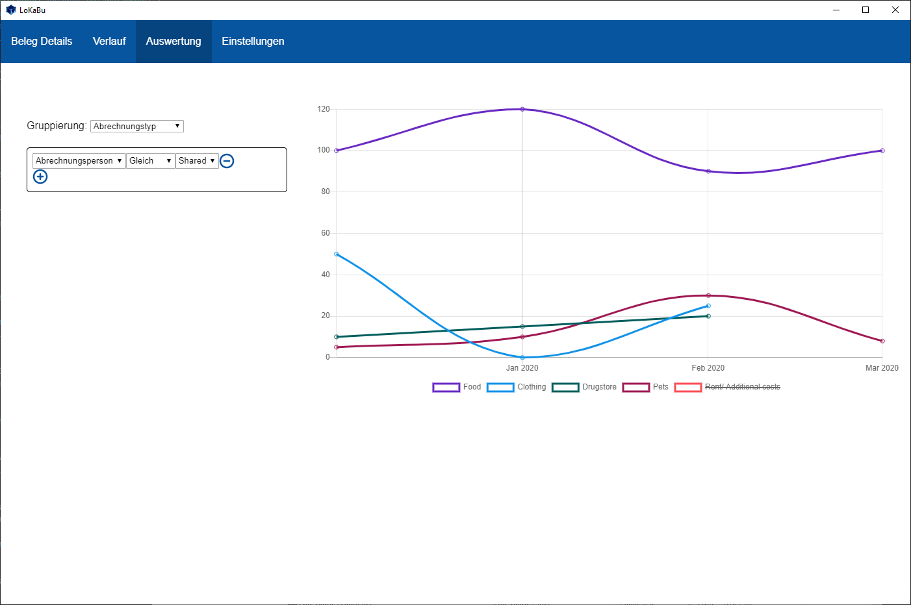
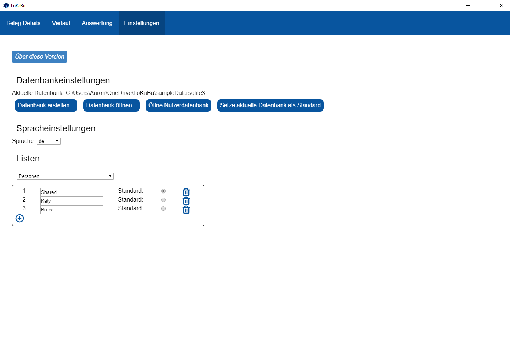

This document is available in: [Deutsch](./README_DE.md), [English](./README.md)
#  LoKaBu [![Latest Release][releaseBadge]][releaseLink] [![Release status][buildBadge]][buildLink] [![GitHub Actions status][testBadge]][testLink]

Dieses Projekt realisiert ein Kassenbuch für den normalen Haushalt. Die Grundidee des Projektes ist über die abgespeicherten Daten volle Kontrolle zu haben. Das Projekt basiert auf der Kombination aus dem Framework Electron und der dateibasierten Datenbank SQLite3.
## Funktionalitäten
### Erstellen/ Öffnen von Datenbanken
Du kannst zusätzlich zur Standard Datenbank eine weitere anlegen, welche an einem beliebigen Ort abgelegt werden kann. Damit kannst du das Kassenbuch auch über Netzwerkordner wie OneDrive oder Dropbox teilen. Um Fehler zu vermeiden ist nur ein Nutzer auf einmal gestattet. Sollte eine andere Person die Datenbank öffnen, bekommst du eine Mitteilung.

### Belege hinzufügen
Du kannst Belege hinzufügen, bearbeiten und löschen. Um bessere Analyseergebnisse zu erreichen werden vordefinierte Auswahllisten verwendet. Um später die Belege einfacher zu finden oder um den Belegen einfach nur weitere Daten anzuhängen kannst du ein Kommentar hinzufügen.

### Verlauf
Im Verlauf kannst du die Belege anhand unterschiedlicher Filtermöglichkeiten durchsuchen.

### Konfiguration von statischen Listen und Werten
Nachdem du ein weiteres Kassenbuch hinzugefügt hast kannst dieses Kassenbuch als deinen Standard festlegen. Desweiteren kannst du eine Standardauswahl für alle Listen angeben Einträge hinzufügen oder bearbeiten.
  *	Abrechnungspersonen
  *	Konten (welche einer Person gehören)
  *	Läden
  *	Abrechnungstypen

### Sprachenunterstützung
Es gibt die Möglichkeit die Übersetzungen um weitere Sprachen zu erweitern. Derzeit sind folgende Sprachen verfügbar:
  * Deutsch
  * Englisch

## Nutzung auf anderen Platformen als Windows
Du musst deinen plattformabhängigen Build selber bauen (und signieren) oder nutzt dieses Repository einfach lokal.

## Mitwirkende
  * Das Logo wurde von [Kirschdrache](https://www.deviantart.com/kirschdrache) erstellt
  * Die Ladeanimation ist auf [loading.io/css/](loading.io/css/) verfügbar

## Bekannte Probleme
  * Problem: Die initale Installation erfordert ein Datenbankupgrade, welches fehlschlägt.
    * Neustart der Applikation
    * Lösche alle Dateien in `%APPDATA%/LoKaBu`

## Bildschirmaufnahmen
  
  
  
  
  

[releaseBadge]: https://img.shields.io/github/v/release/H0rn0chse/LoKaBu.svg
[releaseLink]: https://github.com/H0rn0chse/LoKaBu/releases/latest
[buildBadge]: https://github.com/H0rn0chse/LoKaBu/actions/workflows/build.yml/badge.svg
[buildLink]: https://github.com/H0rn0chse/LoKaBu/actions/workflows/build.yml
[testBadge]: https://github.com/H0rn0chse/LoKaBu/actions/workflows/test.yml/badge.svg
[testLink]: https://github.com/H0rn0chse/LoKaBu/actions/workflows/test.yml
